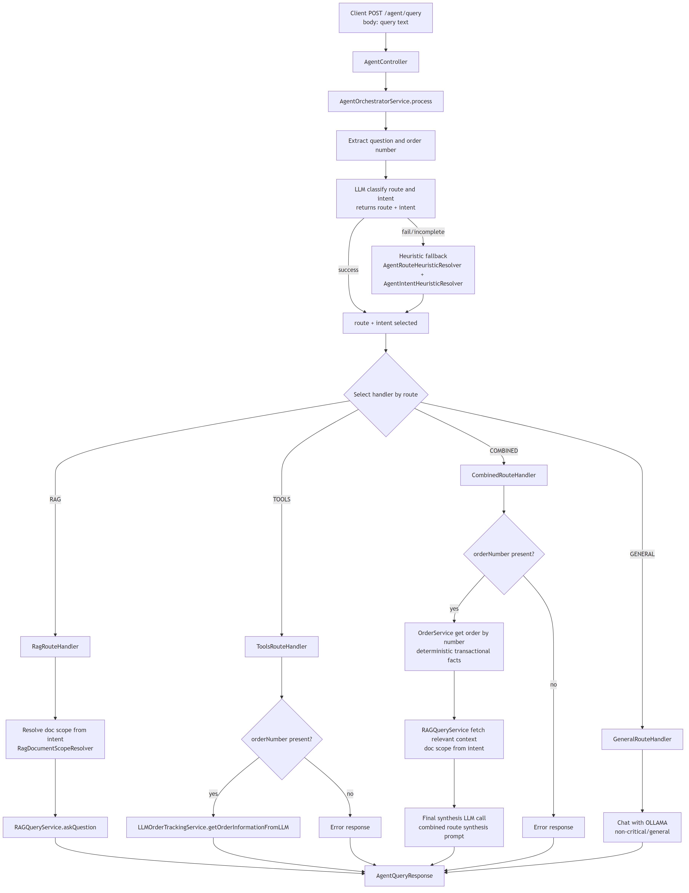
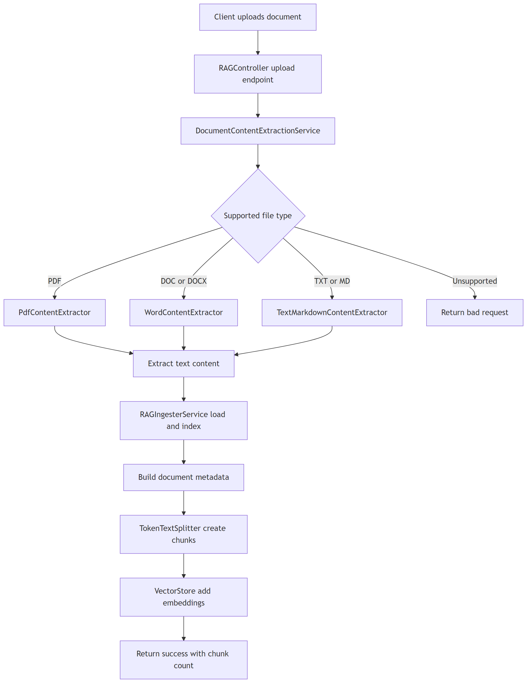
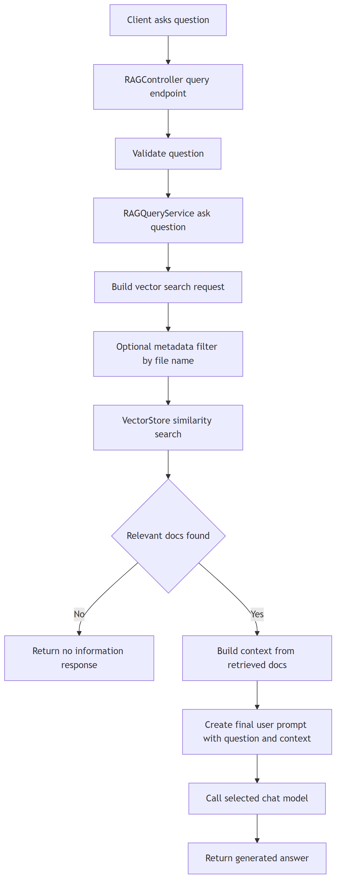
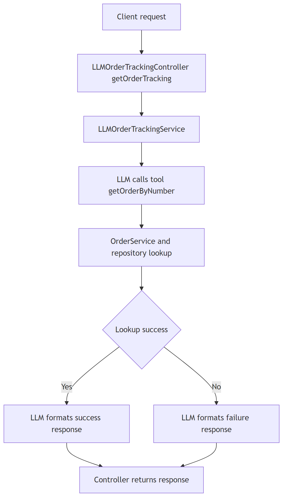
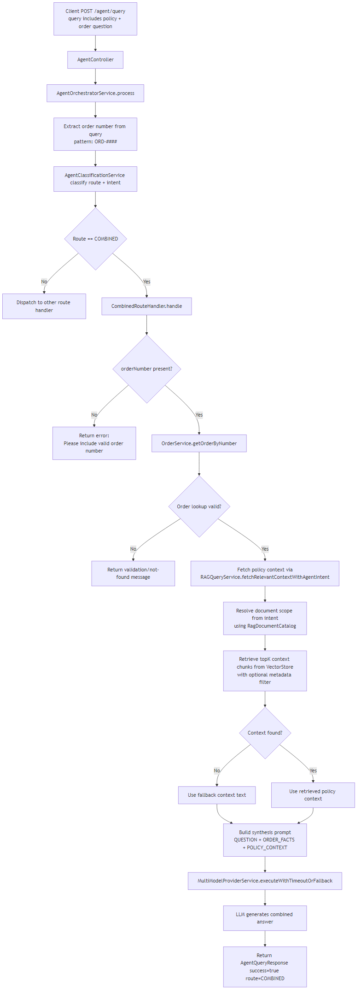
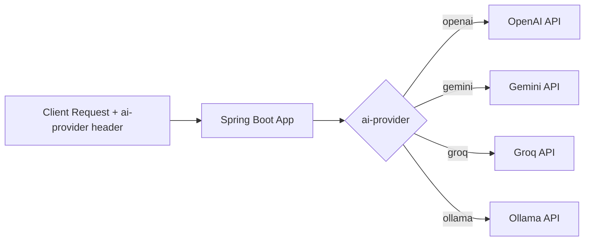
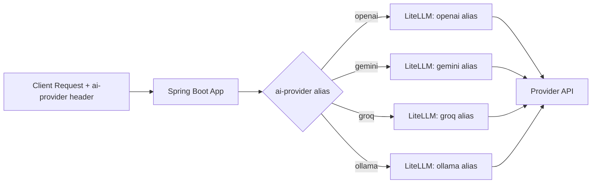

# Spring AI Multi-Agent RAG

This project is a multi-agent AI backend built with Spring Boot and Spring AI.

Core capabilities:
- Agent orchestration flow that classifies user queries into `RAG`, `TOOLS`, `COMBINED`, or `GENERAL` routes
- RAG ingestion and query over document knowledge using PostgreSQL + pgvector
- Tool-calling flow for transactional order operations (lookup, cancellation, delivery updates)
- Combined route that merges deterministic order facts with policy context and uses LLM for final response phrasing
- Multi-provider chat model support (OpenAI, Gemini, Groq, Ollama, and compatible providers)
- LiteLLM gateway integration to route all model calls through one OpenAI-compatible endpoint, enabling centralized guardrails while solving provider switching and key/config sprawl.


## Tech Stack
- Java 21
- Spring Boot 3.5.x
- Spring AI 1.1.x
- Maven Wrapper (`mvnw` / `mvnw.cmd`)

## Prerequisites
- JDK 21 installed
- Internet access for cloud providers (OpenAI/Gemini/Groq/)
- Optional: Ollama running locally if you use provider `ollama`
- Docker installed (to run local instance of Postgres and Lite LLM)

## 1) Setup Environment Variables
The app reads provider keys from `src/main/resources/application.yml`.

Create a local env file first:

### Windows PowerShell
```powershell
Copy-Item .env.example .env
```

### macOS/Linux
```bash
cp .env.example .env
```

Use `.env.example` as the reference for required variables and set real values in `.env`.

Required/optional variables:
- `OPEN_API_KEY` (required if using OpenAI)
- `GEMINI_API_KEY` (required if using Gemini)
- `GROQ_API_KEY` (required if using Groq)
- `LITELLM_MASTER_KEY` (required if using LiteLLM)
- `OLLAMA_BASE_URL` (required if using Ollama through LiteLLM)
- `LITELLM_BASE_URL` (optional, defaults to `http://localhost:4000`)
- `SPRING_DATASOURCE_URL` (JDBC URL for the app DB, default DB as per docker-compose`ai_ecommerce`)
- `SPRING_DATASOURCE_USERNAME` (app DB username default value is `admin` as per docker compose`)`
- `DB_PASSWORD` (password used by Spring datasource default value is `admin123` as per docker compose)
- `DATABASE_URL` (LiteLLM DB URL in Prisma format, default DB as per docker compose points to `litellm`)

Sample AI inference provider entry in `application.yml`:
```yaml
spring:
  ai:
    providers:
      cohere:
        api-key: ${GROQ_API_KEY:}
        model: command-r
        temperature: 0.7
        max-tokens: 500
        base-url: https://api.groq.com/openai/v1
        completion-path: /chat/completions
```

Notes:
- Default provider in controllers is `ollama` when header `ai-provider` is not sent.
- If you use Ollama, ensure Ollama server is running at `http://localhost:11434`.
- Provider beans are created only when their config exists in `application.yml`:
  - `spring.ai.openai.chat.options.model` for OpenAI
  - `spring.ai.providers.<provider>.model` for OpenAI-compatible providers like `gemini`, `groq`, and `ollama`
- If a provider block is removed from YAML, that provider bean is not created and startup does not fail because of that missing provider.
- If `ollama` is the default route target but not configured, the general route returns: `No cheaper model is configured right now. Please configure 'ollama' or try another provider.`
- If no chat providers are configured at all, the app throws an `IllegalStateException` when resolving a chat client.

## 2) Start LiteLLM + PostgreSQL (Docker Compose)
From the project root:

### Windows / macOS / Linux
```bash
docker compose --env-file .env up -d litellm postgres-pgvector
```

Verify DB is running:
```bash
docker compose ps
```

Stop DB when done:
```bash
docker compose down
```

Stop DB and clear data when done:(Data will be lost)
```bash
docker compose down -v
```

PostgreSQL details from `docker-compose.yml`:
- Host: `localhost`
- Port: `5432`
- Application DB: `ai_ecommerce`
- LiteLLM DB: `litellm`
- Username: `admin`
- Password: `admin123`

Postgres init scripts:
- `docker/postgres-init/01-create-litellm-db.sql` creates the `litellm` database.
- Scripts under `docker-entrypoint-initdb.d` run only on first DB initialization.
- If the volume already existed before adding/changing init scripts, run `docker compose down -v` once, then `up`.

LiteLLM details:
- URL: `http://localhost:4000`
- Uses `litellm-config.yaml` model aliases (for example `openai`, `openai-embedding`, `gemini`, `groq`, `ollama`)
- Uses `LITELLM_MASTER_KEY` from `.env`

## 3) Run the Application
From the project root:

### Run Application (Default Mode)

Windows:
```powershell
.\mvnw.cmd spring-boot:run "-Dspring-boot.run.arguments=--spring.config.import=optional:file:.env[.properties]"
```

macOS/Linux:
```bash
./mvnw spring-boot:run -Dspring-boot.run.arguments="--spring.config.import=optional:file:.env[.properties]"
```

Startup schema init:
- `spring.sql.init.schema-locations=classpath:schema.sql` tells Spring Boot to run `src/main/resources/schema.sql` during startup.
- This initializes required database schema objects before the app serves requests.
- `schema.sql` creates:
  - `public.vector_store` for RAG chunk embeddings + metadata
  - `public.rag_document_catalog` for document-level metadata (`file_name`, `document_type`, etc.)
  - `public.orders` for order management/tool-calling flows
- `OrderService` seeds sample orders on startup if `orders` is empty (`ORD-0001` onward). If rows already exist, seeding is skipped.

### Run Application (LiteLLM Mode)

Windows:
```powershell
.\mvnw.cmd spring-boot:run "-Dspring-boot.run.profiles=litellm" "-Dspring-boot.run.arguments=--spring.config.import=optional:file:.env[.properties]"
```

macOS/Linux:
```bash
./mvnw spring-boot:run -Dspring-boot.run.profiles=litellm -Dspring-boot.run.arguments="--spring.config.import=optional:file:.env[.properties]"
```

When `litellm` profile is active:
- Spring loads `src/main/resources/application-litellm.yml`
- Chat + embedding requests are sent to LiteLLM (`spring.ai.openai.base-url=${LITELLM_BASE_URL}`)
- Provider model names are resolved through LiteLLM aliases from `litellm-config.yaml`
- Spring continues using `SPRING_DATASOURCE_URL` (`ai_ecommerce`) while LiteLLM uses `DATABASE_URL` (`litellm`)

Default app URL:
- `http://localhost:8080`


## 4) RAG Configuration
Current RAG setup in this project:

RAG query prerequisite:
- `POST /rag/query` returns meaningful results only after at least one document is uploaded/ingested via `POST /rag/upload`.
- Sample documents are available in `src/main/resources/docs` (the `docs` folder).

- Vector database: PostgreSQL with `pgvector` extension (`pgvector/pgvector:pg16` via Docker Compose)
- Vector store table: `public.vector_store`
- Embedding column: `embedding vector(1536)`
- Embedding model: OpenAI `text-embedding-3-small` (configured in `src/main/resources/application.yml`)
- Vector dimensions: `1536` (configured in `spring.ai.vectorstore.pgvector.dimensions`)
- ANN index type: `HNSW` (configured in `spring.ai.vectorstore.pgvector.index-type`)
- Distance/similarity type: `COSINE_DISTANCE` (configured in `spring.ai.vectorstore.pgvector.distance-type`)
- Vector index SQL: `USING hnsw (embedding vector_cosine_ops)` in `src/main/resources/schema.sql`
- Metadata indexes:
  - GIN index on `metadata` (`jsonb_path_ops`) for JSON filtering
  - B-tree expression indexes on `metadata ->> 'fileName'`
- Splitter: `TokenTextSplitter`

Retrieval defaults in query flow:
- default query `topK=3`
- combined flow `topK=5`
- `similarityThreshold=0.35` (default profile)
- `similarityThreshold=0.6` (litellm profile)

## 5) Flow Diagrams

### 5.1 Agent Query Flow
Intent: Handles a single user query by classifying route and intent, then dispatching to the correct route handler (`RAG`, `TOOLS`, `COMBINED`, or `GENERAL`).
Controller: `AgentController` (`POST /agent/query`) is the unified entrypoint for orchestration.
Source: `flows/AGENT_QUERY_FLOW.md`



### 5.2 RAG Flows
Intent: Shows both document ingestion into vector store and runtime retrieval flow for policy/knowledge Q&A.
Controller: `RAGController` handles both document upload (`POST /rag/upload`) and query (`POST /rag/query`) endpoints.
Source: `flows/RAG_FLOWS.md`

#### Ingestion


#### Query


### 5.3 Tools Flow: getOrderTracking
Intent: Handles order-tracking requests through tool-calling, backed by deterministic order lookup.
Controller: `LLMOrderTrackingController` exposes `GET /order-tracking` for tool-assisted order tracking responses.
Source: `flows/TOOLS_FLOW.md`



### 5.4 Combined Route Flow
Intent: Shows the end-to-end `COMBINED` route flow that merges deterministic order facts with intent-scoped policy context and synthesizes a final answer.
Controller: `AgentController` (`POST /agent/query`) enters orchestration; `CombinedRouteHandler` executes order lookup + RAG context + synthesis.
Source: `flows/COMBINED_ROUTE_FLOW.md`



### 5.5 Model Routing Modes
Intent: Shows how model requests are routed in default mode vs `litellm` profile mode.

#### Default mode (without LiteLLM)


#### LiteLLM mode (`spring.profiles.active=litellm`)


## 6) Postman Collection

Use the included Postman collection to quickly test ingestion, RAG query, agent query, and tools endpoints.

- Collection file: `postman/Spring ai Rag.postman_collection.json`
- Recommended variable:
  - `baseUrl = http://localhost:8080`

Import steps:
1. Open Postman.
2. Click `Import`.
3. Select `postman/Spring ai Rag.postman_collection.json` from this repository.
4. Set environment/header values (for example `ai-provider`) as needed.

## 7) Logging Configuration
Enable AI/LLM logging in `application.yml`:

```yaml
app:
  ai:
    llm-logging:
      enabled: true
```

When enabled, developers can inspect detailed prompt data being sent to the LLM, which helps during debugging and prompt tuning.

## 8) References
- Spring AI: https://spring.io/projects/spring-ai

## 9) Credits
Thanks to HungryCoders for the learning content and guidance: https://www.hungrycoders.com/course/ai-for-java-spring-boot-backend-engineers
