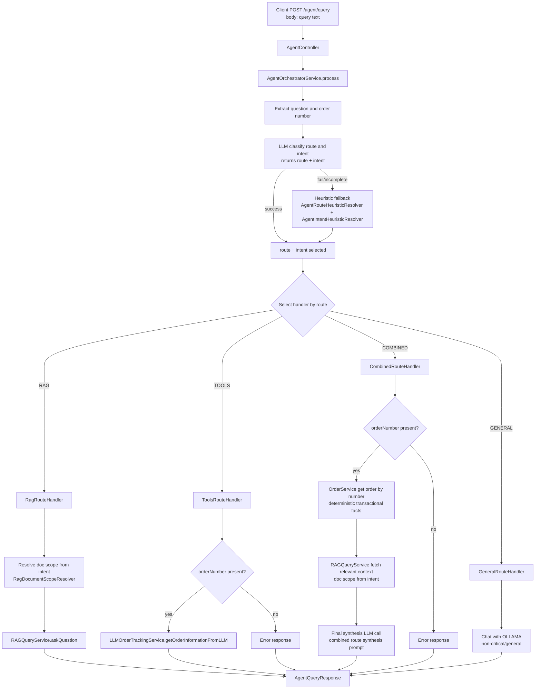

# Agent Query Flow

```mermaid
flowchart TD
    A[Client POST /agent/query<br/>body: query text] --> B[AgentController]
    B --> C[AgentOrchestratorService.process]

    C --> D[Extract question and order number]
    D --> E[LLM classify route and intent<br/>returns route + intent]

    E -->|success| F[route + intent selected]
    E -->|fail/incomplete| E2[Heuristic fallback<br/>AgentRouteHeuristicResolver + AgentIntentHeuristicResolver]
    E2 --> F

    F --> G{Select handler by route}

    G -->|RAG| H[RagRouteHandler]
    G -->|TOOLS| I[ToolsRouteHandler]
    G -->|COMBINED| J[CombinedRouteHandler]
    G -->|GENERAL| K[GeneralRouteHandler]

    H --> H1[Resolve doc scope from intent<br/>RagDocumentScopeResolver]
    H1 --> H2[RAGQueryService.askQuestion]
    H2 --> Z[AgentQueryResponse]

    I --> I1{orderNumber present?}
    I1 -->|no| I2[Error response]
    I1 -->|yes| I3[LLMOrderTrackingService.getOrderInformationFromLLM]
    I3 --> Z
    I2 --> Z

    J --> J1{orderNumber present?}
    J1 -->|no| J2[Error response]
    J1 -->|yes| J3[OrderService get order by number<br/>deterministic transactional facts]
    J3 --> J4[RAGQueryService fetch relevant context<br/>doc scope from intent]
    J4 --> J5[Final synthesis LLM call<br/>combined route synthesis prompt]
    J5 --> Z
    J2 --> Z

    K --> K1[Chat with OLLAMA<br/>non-critical/general]
    K1 --> Z
```
