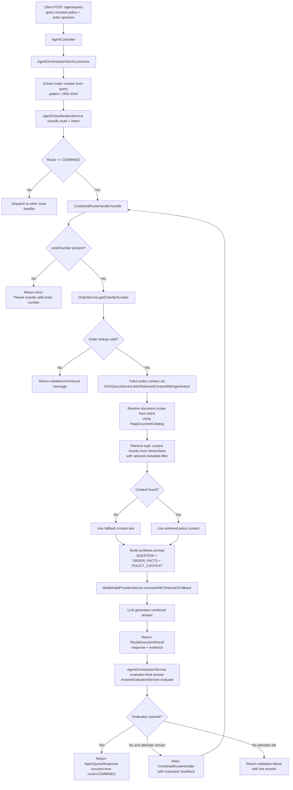

# Combined Route Flow

```mermaid
flowchart TD
    A[Client POST /agent/query<br/>query includes policy + order question] --> B[AgentController]
    B --> C[AgentOrchestratorService.process]
    C --> D[Extract order number from query<br/>pattern: ORD-####]
    D --> E[AgentClassificationService classify route + intent]
    E --> F{Route == COMBINED}
    F -->|No| X[Dispatch to other route handler]
    F -->|Yes| G[CombinedRouteHandler.handle]

    G --> H{orderNumber present?}
    H -->|No| H1[Return error:<br/>Please include valid order number]
    H -->|Yes| I[OrderService.getOrderByNumber]

    I --> J{Order lookup valid?}
    J -->|No| J1[Return validation/not-found message]
    J -->|Yes| K[Fetch policy context via<br/>RAGQueryService.fetchRelevantContextWithAgentIntent]

    K --> K1[Resolve document scope from intent<br/>using RagDocumentCatalog]
    K1 --> K2[Retrieve topK context chunks from VectorStore<br/>with optional metadata filter]
    K2 --> K3{Context found?}
    K3 -->|No| K4[Use fallback context text]
    K3 -->|Yes| K5[Use retrieved policy context]

    K4 --> L[Build synthesis prompt<br/>QUESTION + ORDER_FACTS + POLICY_CONTEXT]
    K5 --> L
    L --> M[MultiModelProviderService.executeWithTimeoutOrFallback]
    M --> N[LLM generates combined answer]
    N --> O[Return RouteExecutionResult<br/>response + evidence]
    O --> P[AgentOrchestratorService evaluates final answer<br/>AnswerEvaluationService.evaluate]
    P --> Q{Evaluation passed?}
    Q -->|Yes| R[Return AgentQueryResponse success=true route=COMBINED]
    Q -->|No and attempts remain| S[Retry CombinedRouteHandler<br/>with evaluation feedback]
    S --> G
    Q -->|No attempts left| T[Return validation failure<br/>with last answer]
```
