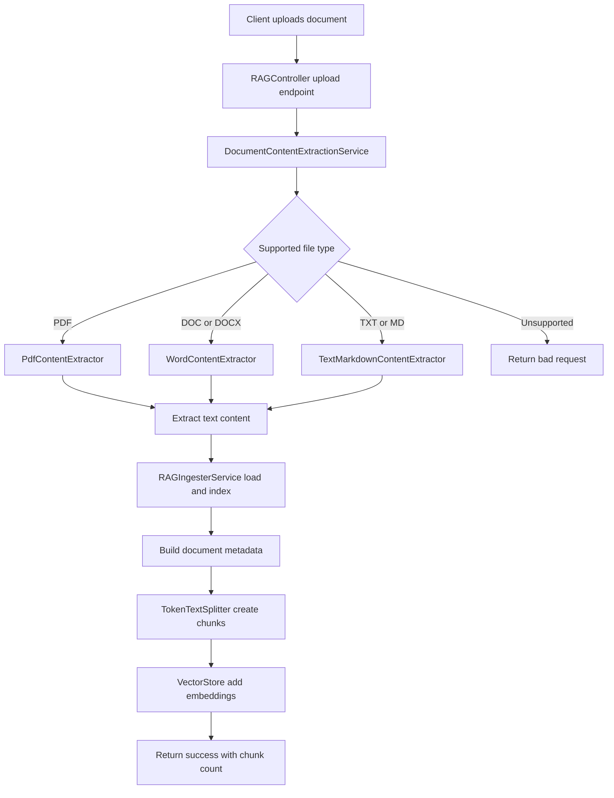
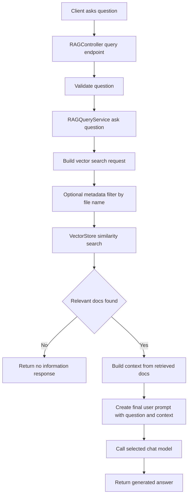

# RAG Flows

## RAG Ingestion Flow

```mermaid
flowchart TD
    A[Client uploads document] --> B[RAGController upload endpoint]
    B --> C[DocumentContentExtractionService]
    C --> D{Supported file type}
    D -->|PDF| E[PdfContentExtractor]
    D -->|DOC or DOCX| F[WordContentExtractor]
    D -->|TXT or MD| G[TextMarkdownContentExtractor]
    D -->|Unsupported| H[Return bad request]
    E --> I[Extract text content]
    F --> I
    G --> I
    I --> J[RAGIngesterService load and index]
    J --> K[Build document metadata]
    K --> L[TokenTextSplitter create chunks]
    L --> M[VectorStore add embeddings]
    M --> N[Return success with chunk count]
```

## RAG Query Flow

```mermaid
flowchart TD
    A[Client asks question] --> B[RAGController query endpoint]
    B --> C[Validate question]
    C --> D[RAGQueryService ask question]
    D --> E[Build vector search request]
    E --> F[Optional metadata filter by file name]
    F --> G[VectorStore similarity search]
    G --> H{Relevant docs found}
    H -->|No| I[Return no information response]
    H -->|Yes| J[Build context from retrieved docs]
    J --> K[Create final user prompt with question and context]
    K --> L[Call selected chat model]
    L --> M[Return generated answer]
```
