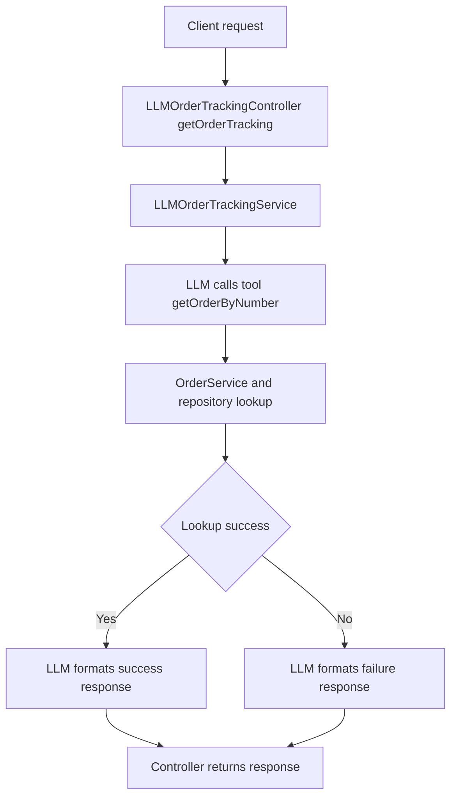

# Tools Flow: getOrderTracking

```mermaid
flowchart TD
    A[Client request] --> B[LLMOrderTrackingController getOrderTracking]
    B --> C[LLMOrderTrackingService]
    C --> D[LLM calls tool getOrderByNumber]
    D --> E[OrderService and repository lookup]
    E --> F{Lookup success}
    F -->|Yes| G[LLM formats success response]
    F -->|No| H[LLM formats failure response]
    G --> I[Controller returns response]
    H --> I
```
